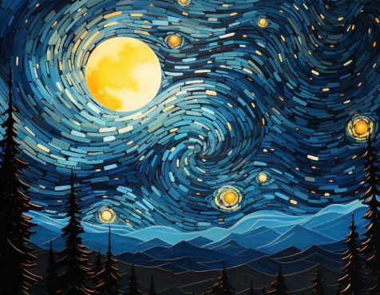

## Vinzent

  O universo é uma grande consciência, um campo com áreas sutis e densas ele é um, de um tudo é emanado, de um tudo vem e para um tudo se vai, tudo dele flui e está em constante movimento, tudo está conectado, tudo é uma coisa só, tudo são variações da mesma coisa, tudo é gerado apartir de uma fonte e a fonte inicial é causadora de todas as outras, você não é limitado apenas ao seu corpo, você pode ser muito mais, você é uma emanação do universo, uma emanação de Deus. E por isso, meu nome é Vinzent.

